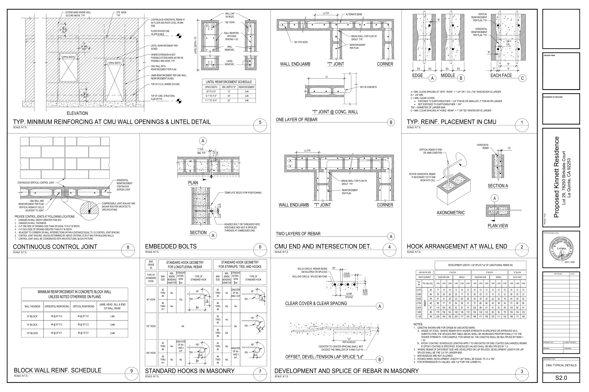

# Commercial Details Package (US)

### 🔍 Project Summary
Development and review of structural detail drawings for commercial construction, focusing on clarity, consistency, and construction-ready documentation.

### 🛠️ Key Responsibilities
- Produced slab-edge, joint, and curb details  
- Standardised reinforcement callouts and notes  
- Responded to design markups and issued revised drawings  

### 📈 Engineering Value
- Improved clarity and consistency across detail sheets  
- Reduced potential for construction errors  
- Supported efficient drawing review and approval cycles  

### 🧠 Skills Demonstrated
- Reinforced concrete detailing  
- Drawing QA and revision control  
- Technical documentation  
- Construction-focused design  

### 🖼️ Sample Work
  
*Expansion/control joint detailing for movement and durability*

  
*Reinforced concrete curb detail ensuring constructability and clarity*

### ⚙️ Tools & Codes
AutoCAD • ACI  

### 📌 Note
Full project packages are confidential. Selected extracts are shown for portfolio purposes.
