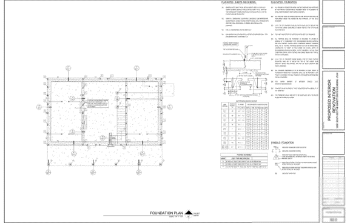
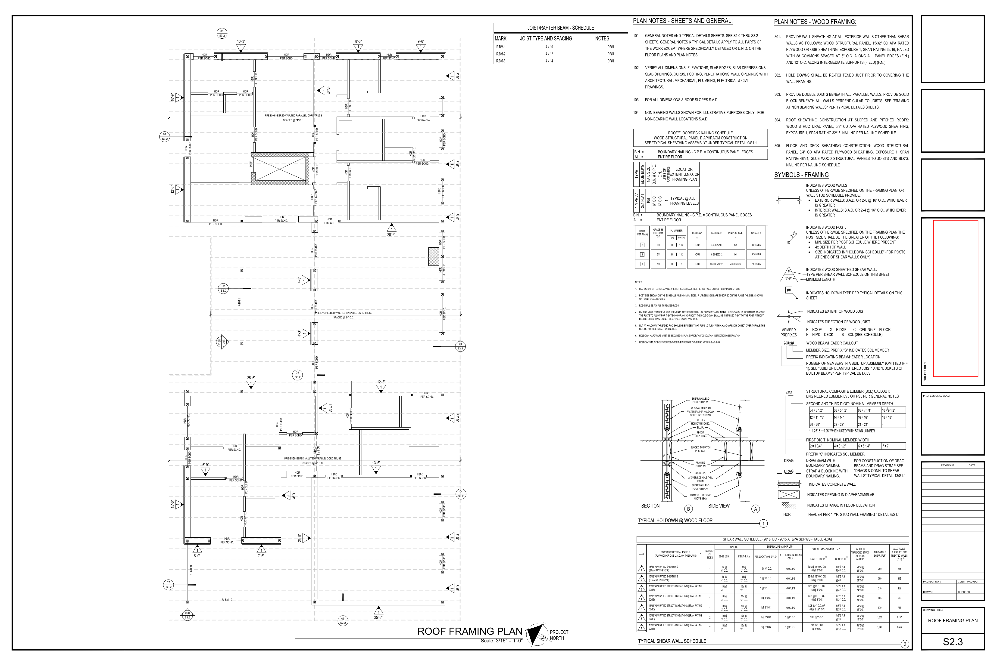

# Residential Foundations & Timber Framing (US)

### 🔍 Project Summary
Structural design support for residential foundation systems and timber framing, focusing on load paths, detailing, and coordination with architectural layouts.

### 🛠️ Key Responsibilities
- Reviewed foundation geometry and load paths  
- Checked anchor and hold-down systems  
- Prepared buildable notes and schedules  
- Coordinated updates with architectural drawings  

### 📈 Engineering Value
- Improved clarity of construction details, reducing site queries and rework  
- Ensured load paths and anchorage systems were structurally consistent  
- Supported coordination between structural and architectural disciplines  

### 🧠 Skills Demonstrated
- Structural analysis  
- Foundation design  
- Load path verification  
- Drawing coordination  
- Buildability-focused detailing  

### 🖼️ Sample Work
  
*Foundation layout showing load path distribution*

  
*Foundation layout showing load path distribution*

  
*Roof layout showing timber load path distribution*

### ⚙️ Tools & Codes
AutoCAD • IRC / IBC  

### 📌 Note
Full project packages are confidential. Selected extracts are shown for portfolio purposes.
